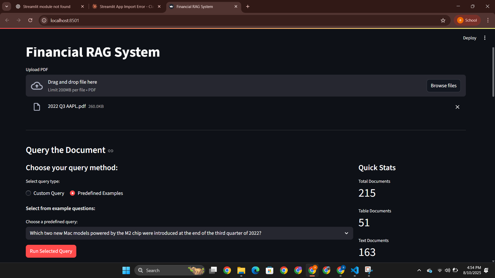
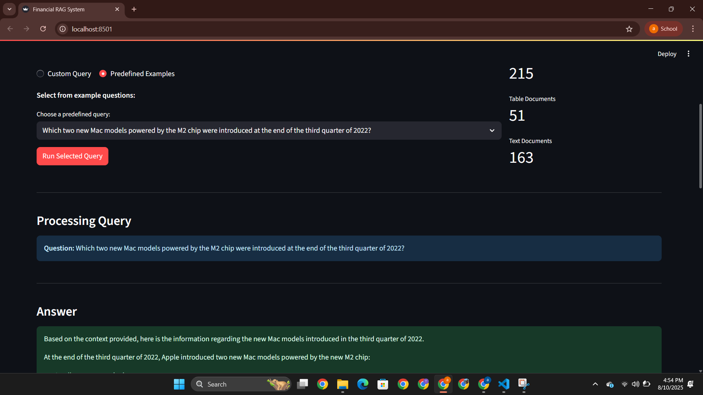
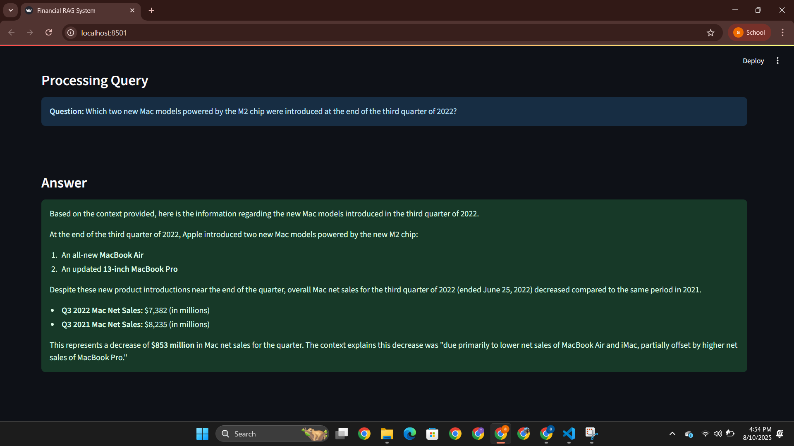
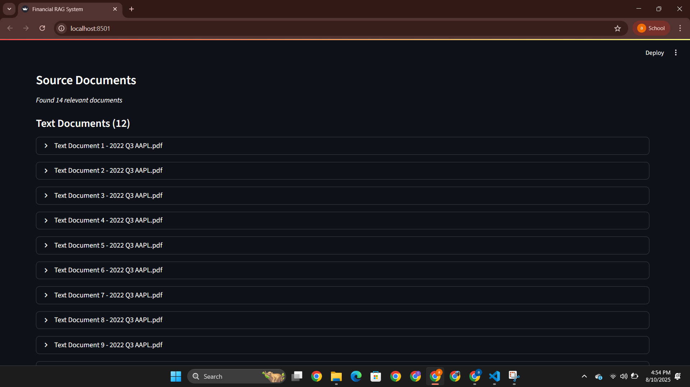
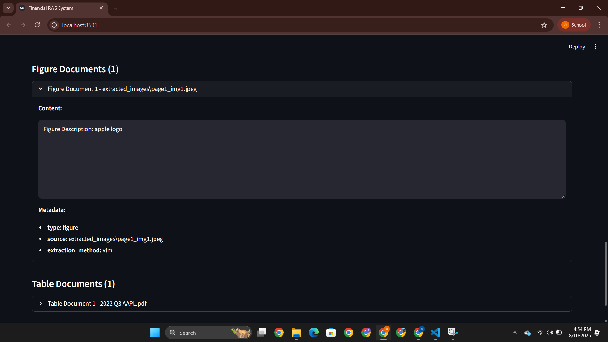
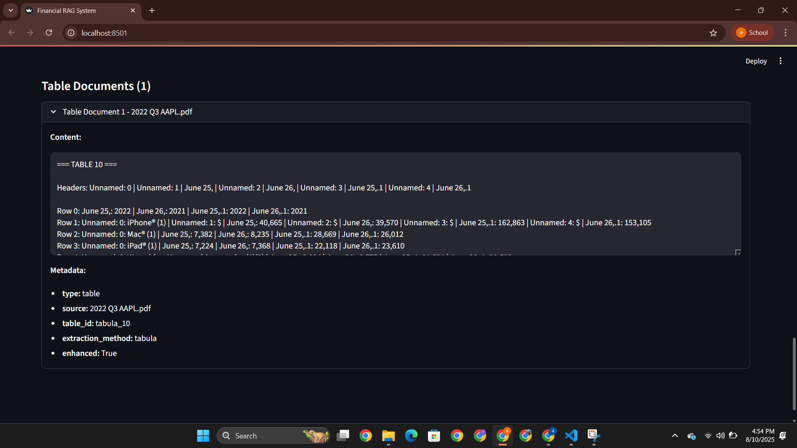
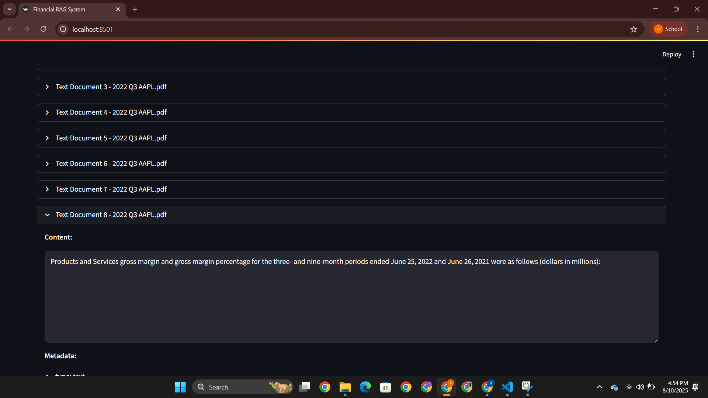

# Financial Document Processing System

A multimodal document processing system for financial data extraction and intelligent querying. Transforms PDF documents into queryable knowledge through advanced parsing, vector storage, and retrieval-augmented generation.

## Features & Key Compnents

- **Multimodal Processing**: Extracts text, tables, and images from PDF documents with BLIP vision-language model for automatic image captioning
- **Multi-Strategy Table Extraction**: Three-tier approach using Camelot (lattice detection), Tabula (stream processing), and Unstructured ML (complex layouts)
- **Hybrid Retrieval**: Ensemble approach combining BM25 keyword search (30%) with FAISS semantic search (70%)
- **Financial Optimization**: Automatic keyword extraction, temporal context addition, and numerical precision handling for financial documents
- **Configuration Management**: Centralized settings with secure API key handling and optimized parameters
- **Dual Interface**: Command-line and web-based Streamlit interfaces

## Technical Architecture

The system employs a modular three-stage pipeline. Document processing extracts multimodal content using multiple extraction strategies. Vector storage creates searchable embeddings optimized for financial terminology. Query processing generates precise answers through hybrid retrieval and prompt engineering.

## Project Structure

```
financial_rag/
├── apps/
│   ├── cli/                    # Command line interface
│   └── streamlit_app/          # Web interface
├── src/
│   └── financial_rag/
│       ├── config/             # Configuration settings
│       ├── parsers/            # Document parsing logic
│       ├── retrieval/          # Search and retrieval engine
│       └── utils/              # Helper functions
├── data/
│   ├── documents/              # Input PDF files
│   ├── extracted_images/       # Extracted figures
└── requirements.txt
```


## Quick Start

### Prerequisites

```bash
pip install -r requirements.txt
```

Create `.env` file:
```bash
GOOGLE_API_KEY=your_google_api_key_here
```

### Running the Application

**Web Interface (Recommended):**
```bash
python -m streamlit run apps/streamlit_app/main.py
```

**Command Line Interface:**
```bash
python -m apps.cli.main
```

## Usage

### Web Interface
Upload PDF documents through the Streamlit interface and query them interactively in real-time.

### CLI Interface
Place PDF documents in `data/document/` directory and run batch processing with pre-configured queries.

## Visual Documentation

### Demo Video
[Watch Demo Video](images/demo_mm_rag.mp4)

### System Screenshots













